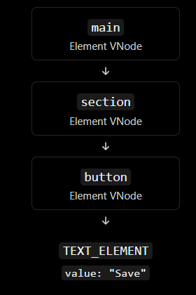

# PROJECT_REPORT.md

# Mini-React: A Lightweight Reactive UI Framework

## 1. Project Overview

### 1.1 Objective

The objective of this project is to build a lightweight UI framework from scratch using vanilla JavaScript. The project explores how core frontend framework concepts work internally, including Virtual DOM creation, DOM rendering, state management, event delegation, and asynchronous UI updates.

Rather than relying on React or another UI framework, Mini-React implements its own foundational mechanisms and uses them to build reactive user interfaces.

### 1.2 Project Scope

The project includes the following features:

- Virtual DOM node creation through `createElement()` and `createTextElement()`.
- Recursive rendering of VNodes into real DOM nodes through `renderToDOM()`.
- State management and reactive state updates.
- Root-level event delegation.
- A reactive Task Manager application.
- A resilient asynchronous data component with loading, success, error, and retry behavior.
- Automated testing, accessibility checks, and security verification.

### 1.3 Technologies Used

- HTML5
- CSS3
- JavaScript ES Modules
- Node.js for automated tests
- Git and GitHub for version control
- Chrome DevTools for DOM inspection and browser verification

## 2. System Architecture

Mini-React is organized into separate modules, each responsible for a specific part of the UI lifecycle.

| Module | Responsibility |
|---|---|
| `createElement.js` | Creates structured Virtual DOM nodes. |
| `renderToDOM.js` | Converts VNodes into real DOM elements and text nodes. |
| `state.js` | Provides the state storage and update mechanism. |
| `useState.js` | Provides reactive state access where supported by the existing state engine. |
| `events.js` | Manages delegated event handling. |
| `app.js` | Implements the Task Manager application. |
| `asyncDataComponent.js` | Implements the asynchronous data state machine, request handling, and UI. |
| `asyncDataComponent.css` | Defines the skeleton animation and component styling. |

The asynchronous component reuses the existing Virtual DOM factory, renderer, and event-handling architecture instead of introducing another rendering system.

### Figure 1 — Project architecture




## 3. Implementation Milestones

### 3.1 Virtual DOM Factory

The `createElement()` factory converts element descriptions into a consistent VNode structure containing a type, props object, and children array.

Text values are converted into text VNodes. Nested child arrays are flattened, while valid VNodes are preserved. Null, undefined, and boolean children are ignored according to the factory contract.

The factory creates data structures only; it does not directly create browser DOM nodes.

### 3.2 Recursive DOM Renderer

The `renderToDOM()` function converts the VNode tree into real DOM nodes.

The renderer:
- Validates the VNode structure.
- Creates text nodes using `document.createTextNode()`.
- Creates semantic elements using `document.createElement()`.
- Applies explicitly supported properties and attributes.
- Recursively renders children in the correct order.
- Preserves the original VNode tree.
- Supports integration with the existing event delegation mechanism.

### 3.3 State Management and Event Delegation

The state engine provides the foundation for reactive UI updates. The event delegation module allows supported event handlers to be managed through the existing event architecture instead of attaching separate native listeners to every child.

These mechanisms are reused by the application and the asynchronous data component where their established contracts permit.

### 3.4 Reactive Task Manager

The Task Manager demonstrates how the framework's state and event mechanisms can support a functional user interface.

The application supports task creation, completion, deletion, and filtering by All, Active, and Completed status. The interface updates in response to user interactions.

**Insert Image 2 here: Task Manager application.**

Capture the application with several tasks visible, including a completed task and the filter controls.

*Suggested filename: `screenshots/02-task-manager.png`*

### 3.5 Resilient Asynchronous Data Component

The asynchronous component manages data requests using exactly four UI states:

- `IDLE`: The component is ready to request data.
- `LOADING`: The request is in progress and a skeleton is displayed.
- `SUCCESS`: Validated response data is displayed.
- `ERROR`: A human-readable error message and retry action are displayed.

A central transition mechanism validates state changes. Each request receives a monotonically increasing identifier so that outdated responses cannot overwrite the result of a newer request.

The component also supports request cancellation where possible and invalidates outstanding work during disposal. Cancellation is not relied upon as the only protection against stale responses.

The response is validated before its fields are used. Empty valid responses are handled separately from malformed data.

## 4. User Interface and Browser Evidence

This section records the visual evidence required to demonstrate the component's behavior.

### 4.1 Loading State and Skeleton

**Insert Image 3 here: Loading skeleton.**

Capture the browser while the component is in `LOADING`. The screenshot should show the skeleton placeholders, the component's semantic content area, and the accessible loading-status element in the rendered DOM if practical.

*Suggested filename: `screenshots/03-loading-skeleton.png`*

The skeleton is implemented in CSS, reserves space for the expected content, and respects the user's reduced-motion preference.

### 4.2 Success State

**Insert Image 4 here: Successful data rendering.**

Capture the component after a valid request succeeds. The screenshot should show the returned data rendered as semantic content.

*Suggested filename: `screenshots/04-success-state.png`*

This evidence should demonstrate that the skeleton has been replaced by the latest successful response.

### 4.3 Error State and Retry Recovery

**Insert Image 5 here: Error state and retry button.**

Capture the component after a request fails. Ensure the human-readable error message and the **Retry Connection** button are visible.

*Suggested filename: `screenshots/05-error-retry.png`*

Then activate the retry button and verify that a new request starts. If the retry succeeds, capture the recovered success state as additional evidence.

*Suggested filename: `screenshots/06-retry-recovery.png`*

### 4.4 Semantic DOM Inspection

**Insert Image 7 here: Chrome DevTools Elements panel.**

Open Chrome DevTools and select the Elements panel. Capture the rendered component tree, showing the expected semantic elements and the absence of unnecessary wrapper elements.

*Suggested filename: `screenshots/07-semantic-dom.png`*

This screenshot should demonstrate the actual browser DOM structure. It should not be replaced by a screenshot of the source code alone.

## 5. Security and Safe Rendering

Security is an important part of the Mini-React implementation.

### 5.1 Safe Text Rendering

Text values are rendered through text nodes instead of being parsed as HTML. The implementation does not use `innerHTML` to render untrusted response content.

For the security test, use the following literal string:

`<script>alert(1)</script>`

Expected result:

- The string is displayed literally.
- No script element is created from the string.
- The JavaScript contained in the string does not execute.

### 5.2 Input and Response Validation

The VNode factory and renderer validate their inputs before creating DOM nodes. The asynchronous component validates response data before using its fields.

The component also avoids exposing stack traces or sensitive implementation details in user-facing error messages.

### 5.3 XSS Verification Evidence

**Insert Image 8 here: XSS-safe text rendering.**

Capture the browser and DevTools Elements panel with the test string visible as literal text. The screenshot should make it possible to distinguish the text content from a real script element.

*Suggested filename: `screenshots/08-xss-safe-text.png`*

A screenshot alone does not prove that JavaScript never executed. The automated security test must also pass.

## 6. Automated Testing

Automated tests are used to verify the Virtual DOM factory, renderer, and asynchronous component independently.

### 6.1 Virtual DOM Factory Tests

The factory tests cover:
- VNode structure and nested hierarchy.
- Props and children normalization.
- Recursive child-array flattening.
- Numeric zero and empty-string handling.
- Invalid element types and malformed children.
- Literal handling of HTML-like text.

Recorded result: **18/18 tests passed.**

### 6.2 Renderer Tests

The renderer tests cover:
- Recursive element creation.
- Text-node rendering.
- Supported attributes and boolean properties.
- Invalid VNode rejection.
- Safe text rendering.
- Root mounting and event compatibility.

Recorded result: **12/12 tests passed.**

### 6.3 Asynchronous Component Tests

The asynchronous component tests cover:
- Valid and invalid state transitions.
- Successful, failed, and empty responses.
- Stale-response protection.
- Stale rejection handling.
- Retry recovery.
- Cleanup and disposal.
- Safe handling of HTML-like strings.

Recorded result: **10/10 tests passed.**

### 6.4 Test Execution

Run the following commands from the project root:

```bash
node --experimental-default-type=module createElement.test.js

node --experimental-default-type=module renderToDOM.test.js

node --experimental-default-type=module asyncDataComponent.test.js
```

The recorded combined result is **40/40 automated tests passed**.

**Insert Image 9 here: Automated test output.**

Capture the terminal showing the test commands and successful results. Include enough output to identify the test suites and their pass counts.

*Suggested filename: `screenshots/09-automated-test-results.png`*

### 6.5 Race-Condition and Retry Evidence

**Insert Image 10 here: Async safety test results.**

Capture the test output demonstrating that outdated responses are ignored, a failed request can be retried successfully, and HTML-like text remains safe.

*Suggested filename: `screenshots/10-async-safety-tests.png`*

If these results are already visible in Image 9, a separate screenshot is optional. Do not claim a test passed unless it has actually been executed.

## 7. Accessibility

The implementation considers accessibility in both the semantic DOM structure and the asynchronous component.

The component provides:
- Semantic HTML elements.
- A status region for loading feedback.
- An alert region for errors.
- A clearly named, keyboard-accessible retry button.
- Visible keyboard focus indicators.
- Decorative skeleton elements hidden from assistive technology.
- Reduced-motion support for users who prefer less animation.

**Insert Image 11 here: Accessibility and reduced-motion verification.**

Capture a relevant DevTools inspection or browser view showing the accessible status/error elements or the reduced-motion behavior.

*Suggested filename: `screenshots/11-accessibility-check.png`*

## 8. Performance and Reliability

The component uses CSS for skeleton animation rather than JavaScript animation loops. The loading layout reserves space to reduce layout shifts.

Request identifiers protect the interface from out-of-order asynchronous responses. Request cancellation is used where available, while request identity remains the correctness mechanism.

The component does not introduce polling or require a backend for its demonstration. A mock data source can be used to test success, failure, and retry behavior deterministically.

Performance claims should be supported by measurements if numerical targets are reported.

## 9. Git and Version Control

The project is organized into implementation milestones to keep the work reviewable and reduce unrelated changes within commits.

The asynchronous component milestone uses the required commit message:

```text
feat(ui): implement multi-state data component with skeleton feedback
```

The intended feature files are:

- `asyncDataComponent.js`
- `asyncDataComponent.css`
- `asyncDataComponent.test.js`
- `asyncDataComponent.demo.html`

Before committing, inspect the staged changes:

```bash
git status
git diff --cached
git show --stat --oneline HEAD
```

Only feature-related files should be included in the asynchronous component commit.

**Insert Image 12 here: Git commit evidence.**

Capture the terminal showing the required commit message and the files included in the commit.

*Suggested filename: `screenshots/12-git-commit.png`*

## 10. Limitations and Future Improvements

The current milestone focuses on the core UI architecture and resilient asynchronous rendering. The demo uses a mock data source and does not require a backend.

Potential future improvements include:
- Integrating a real API through the existing data-source interface.
- Expanding browser-level automated testing.
- Measuring layout shifts and rendering performance under realistic workloads.
- Extending the renderer only when a future milestone explicitly requires it.

Virtual DOM reconciliation and a generalized diffing engine remain outside the scope of this milestone.

## 11. Conclusion

This project demonstrates how foundational UI framework features can be implemented using vanilla JavaScript. The Virtual DOM factory, recursive renderer, state engine, event delegation system, Task Manager, and resilient asynchronous data component provide a modular foundation for building reactive user interfaces.

The asynchronous component adds explicit state transitions, loading feedback, safe response rendering, accessible error recovery, request identity, and lifecycle cleanup.

The recorded automated tests provide evidence for the factory, renderer, and asynchronous component contracts. Browser screenshots and DevTools inspection should be included to complete the visual and integration evidence.

## 12. Evidence Checklist

- [ ] Image 1 — Project architecture diagram.
- [ ] Image 2 — Task Manager application.
- [ ] Image 3 — Loading skeleton.
- [ ] Image 4 — Success state.
- [ ] Image 5 — Error state and retry button.
- [ ] Image 6 — Retry recovery.
- [ ] Image 7 — Semantic DOM in Chrome DevTools.
- [ ] Image 8 — XSS-safe literal text.
- [ ] Image 9 — Automated test results.
- [ ] Image 10 — Stale-response and retry tests.
- [ ] Image 11 — Accessibility verification.
- [ ] Image 12 — Required Git commit.

Only include screenshots that you have actually captured. If two screenshots provide the same evidence, they may be combined to keep the report concise.